# Revisiting the Necessity of Lengthy Chain-of-Thought in Vision-centric Reasoning Generalization

[](https://github.com/)
[](https://www.google.com/search?q=LICENSE)

**TL;DR:** In vision-centric reasoning (e.g., mazes, puzzles), **"Short is Long"**. Our research reveals that concise, coordinate-based reasoning generalizes significantly better than verbose language or visual manipulation CoT chains.

-----

## 📖 Overview

Recent advancements in Vision-Language Models (VLMs) often rely on lengthy Chain-of-Thought (CoT) or "Thinking with Images" (Visual CoT) to improve reasoning. However, does more verbose or visual reasoning actually lead to better **generalization**?

In this work, we systematically evaluate different CoT designs using a controlled maze-solving benchmark (and validate on real-world tasks). We utilize a **SFT-then-RL** (Supervised Fine-Tuning followed by Reinforcement Learning) pipeline based on **Qwen2.5-VL-7B**.

### Key Findings

1.  **Visual CoT Accelerates, but Doesn't Elevate:** Methods that "draw" on images (Visual CoT) speed up convergence during RL but do not raise the final performance ceiling compared to simpler methods.
2.  **Concise Grounding is Better:** A minimal trajectory of coordinates (Implicit CoT / G-CoT-least) outperforms verbose step-by-step language reasoning.
3.  **The "Short is Long" Effect:** The most concise formats (containing only essential grounding/path info) achieve the **best generalization** across different scales (e.g., training on $6\times6$ mazes and solving $7\times7$ mazes).

-----

## 🧠 CoT Paradigms Compared

We isolate and compare three distinct ways of externalizing reasoning:

| Method | Description | 
| :--- | :--- |
| **Language CoT** | Pure text reasoning (e.g., "Move North, then West...") | 
| **Grounding CoT** | Text linked with coordinates (e.g., "Move to [x,y]...") | 
| **Visual CoT** | Interleaved image manipulation (drawing lines/marks) |
| **G-CoT-least** | **Implicit sequence of coordinates/path only.** |

-----

## 📊 Experimental Highlights

### 1\. Visual CoT Improves Efficiency, Not Efficacy

Visual CoT does not offer a higher performance upper bound compared to Language or Grounding CoT, but only accelerates training.
<p align="center">
  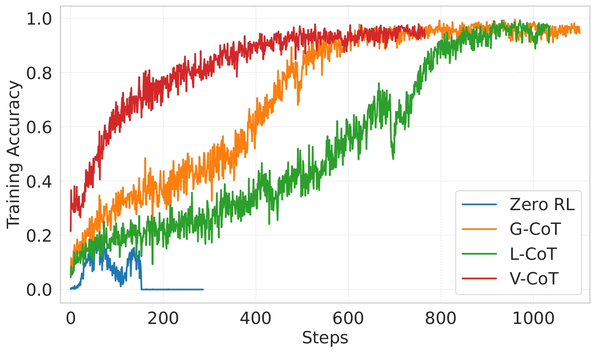
  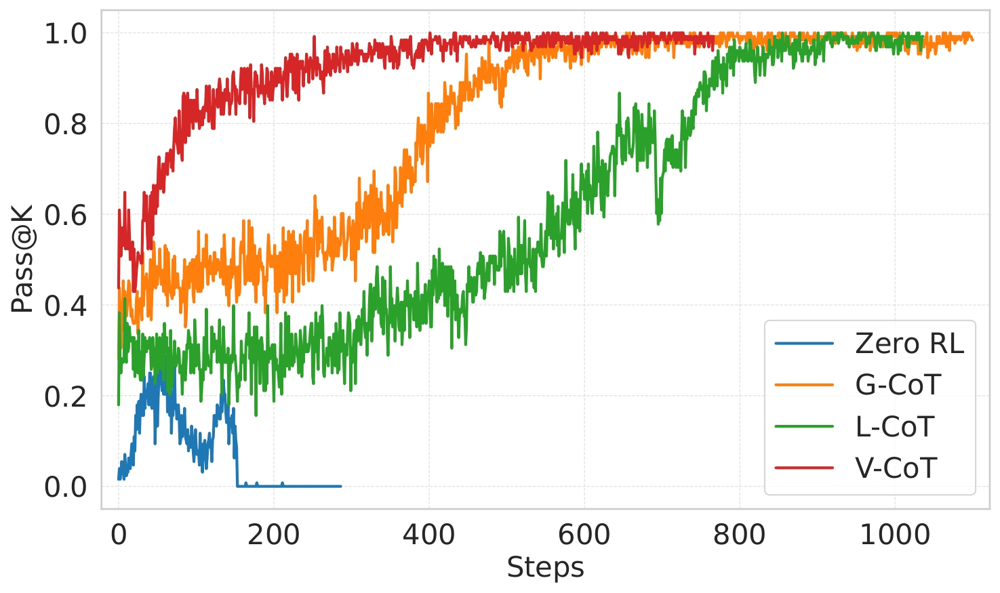
  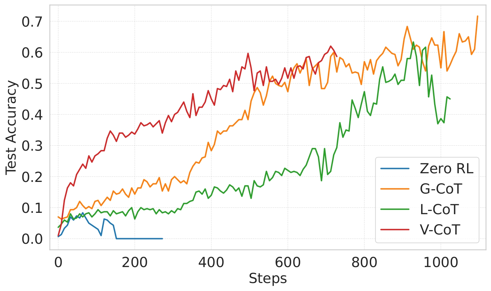
</p>


### 2\. Short CoT Surpasses Longer Ones

The VLM can conduct implicit reasoning after its grounding ability is aligned with the visual environment, achieving full accuracy and faster convergence.
<p align="center">
  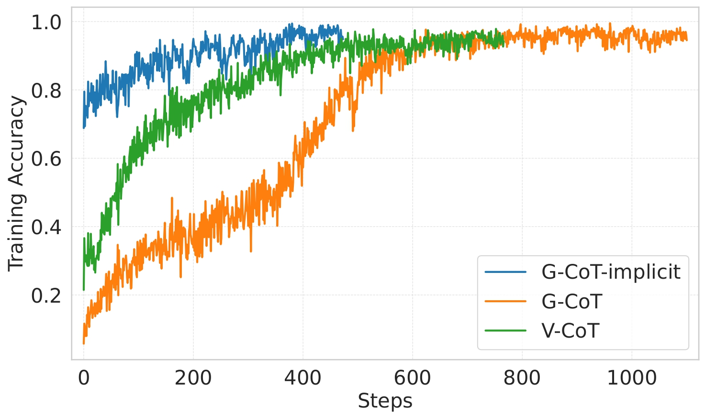
  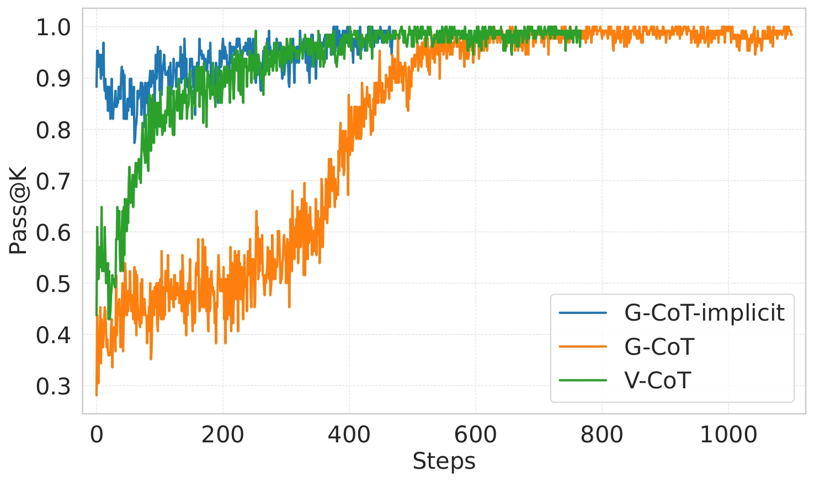
  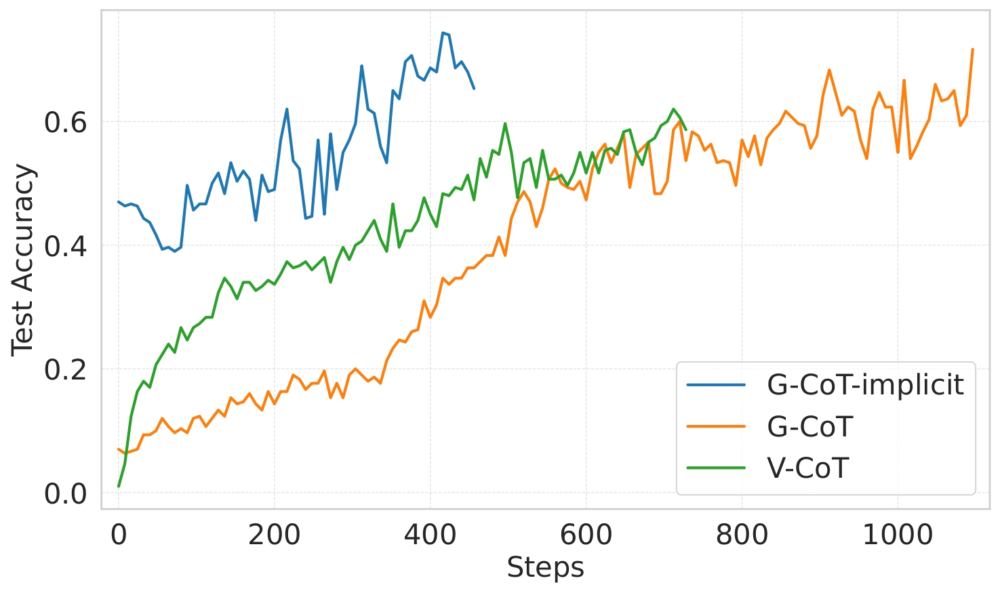
</p>

### 3\. Least CoT Achieves Better Generalization

Properly aligned grounding ability allows the model to generalize its spatial reasoning effectively to new visual environments.
<p align="center">
  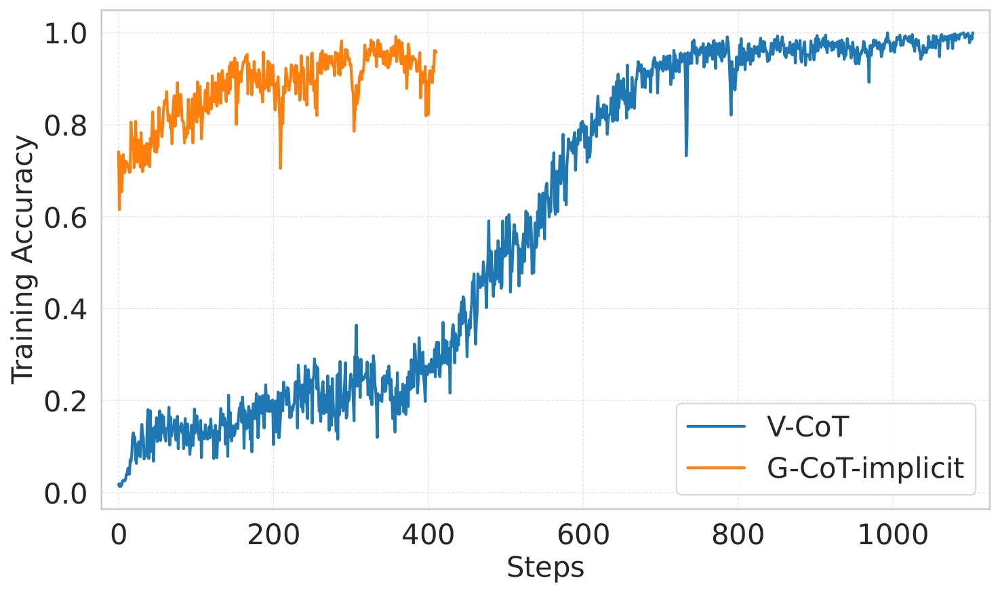
  
  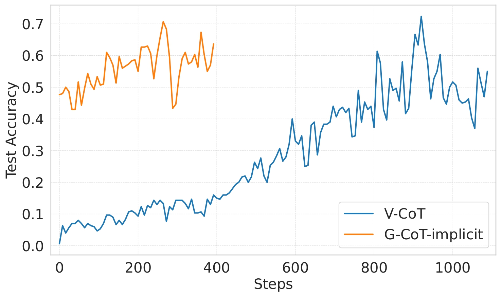
</p>

<p align="center">
  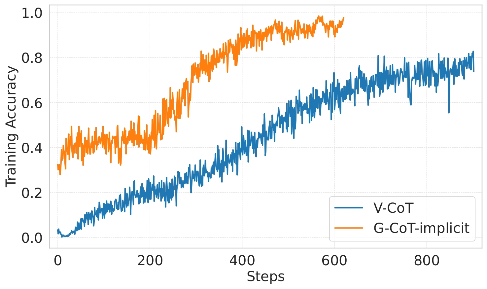
  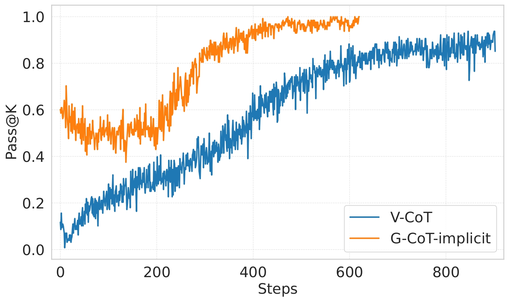
  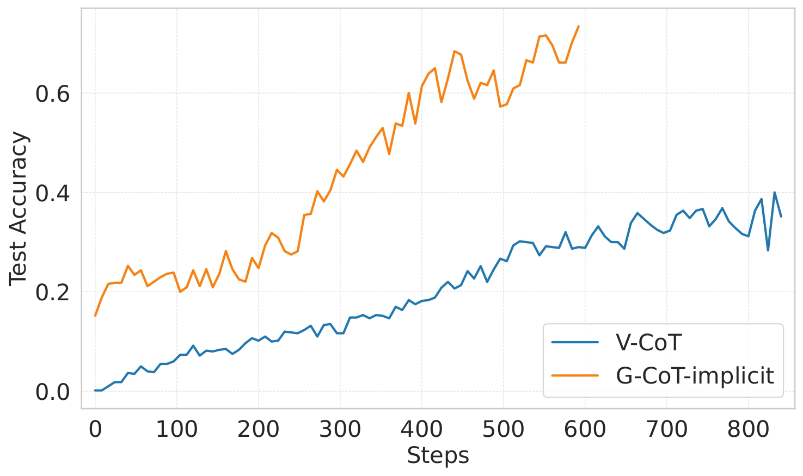
</p>

### 4\. Beyond Mazes

We validated our "Short is Long" hypothesis on broader vision-centric tasks:

  - **Visual Games:** FrozenLake, Jigsaw Puzzles.
  - **Real-world VQA:** $V^*$ Bench, HR-Bench.
  - **Result:** G-CoT-least consistently achieved state-of-the-art results compared to verbose CoT methods.

<table>
  <caption>Evaluation results on other vision reasoning tasks, where the best-performed results are marked as <strong>bold</strong>.</caption>
  <thead>
    <tr>
      <th rowspan="2">Model</th>
      <th colspan="3">$V^*$ Bench</th>
      <th colspan="3">HR-Bench 4K</th>
      <th rowspan="2">Frozenlake</th>
      <th rowspan="2">Jigsaw</th>
    </tr>
    <tr>
      <th>Attr</th>
      <th>Spatial</th>
      <th>Overall</th>
      <th>FSP</th>
      <th>FCP</th>
      <th>Overall</th>
    </tr>
  </thead>
  <tbody>
    <tr>
      <td>Qwen2.5-VL-7B</td>
      <td>67.83</td>
      <td>78.95</td>
      <td>72.25</td>
      <td>88.00</td>
      <td>57.00</td>
      <td>72.50</td>
      <td>20.00</td>
      <td>0.00</td>
    </tr>
    <tr>
      <td>+ V-CoT RL</td>
      <td>86.09</td>
      <td>78.95</td>
      <td>83.25</td>
      <td>87.00</td>
      <td>57.00</td>
      <td>72.00</td>
      <td>-</td>
      <td>-</td>
    </tr>
    <tr>
      <td>+ G-CoT-least RL</td>
      <td><strong>87.83</strong></td>
      <td><strong>82.89</strong></td>
      <td><strong>85.86</strong></td>
      <td><strong>90.75</strong></td>
      <td><strong>57.50</strong></td>
      <td><strong>74.12</strong></td>
      <td><strong>90.33</strong></td>
      <td><strong>75.60</strong></td>
    </tr>
  </tbody>
</table>

-----


## citation

If you find this work helpful for your research, please consider citing:

```bibtex

```
